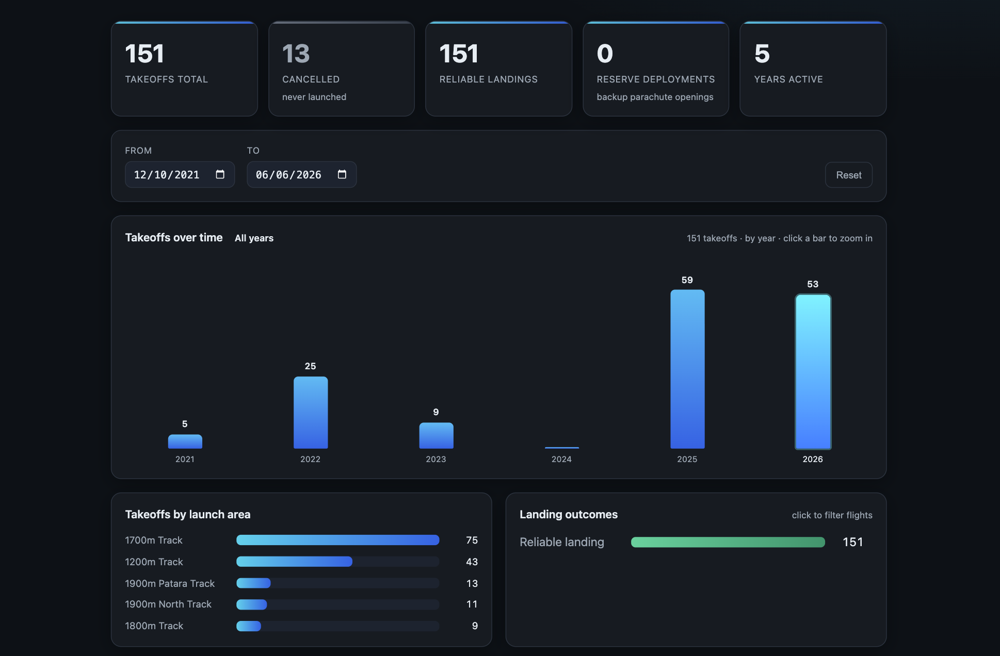

# Babadağ Flight Stats 🪂

See **your own** Babadağ / Ölüdeniz (Fethiye) paragliding stats in your browser —
total takeoffs, reserve‑parachute deployments, and a click‑to‑zoom day / month / year
chart with date filters. It reads your flights from the same place the official SHM
mobile app does.



## 1. Install Node.js

You only need **Node.js** (version 18 or newer). If you don't have it,
[download and install it from nodejs.org](https://nodejs.org) — pick the “LTS” button.

## 2. Download this app

Open a terminal (on macOS: *Terminal*, on Windows: *PowerShell*) and run:

```bash
git clone https://github.com/AntipovAndrey/babadag-statistics
cd babadag-statistics
```

## 3. Run it (first time)

Use the **same e‑mail and password** you use in the Babadağ SHM mobile app:

```bash
node bin/babadag-stat.js username=YOUR_EMAIL password=YOUR_PASSWORD
```

Your stats report opens automatically in your browser. To stop it, go back to the
terminal and press **Ctrl + C**.

## 4. Run it again later (no password needed)

Your flights are saved on your computer the first time, so afterwards you can just run:

```bash
node bin/babadag-stat.js
```

No e‑mail or password required. To download your newest flights again, add `--refresh`:

```bash
node bin/babadag-stat.js username=YOUR_EMAIL password=YOUR_PASSWORD --refresh
```

That's everything you need. 🪂

---

<!-- ===================================================================== -->
<!-- Everything below is for developers.                                   -->
<!-- ===================================================================== -->

## For developers

A tiny zero‑dependency **Node CLI**. It is **not** a hosted SPA — you run one command
and it:

1. logs in to the SHM mobile API (`POST /api/Token/SinglePost`) and gets a JWT,
2. downloads your personal flight history **once** (`GET /api/Single/GetFlightHistory`)
   and caches it as JSON under `./data`,
3. starts a tiny local Node server that **relays** that JSON, and
4. opens the interactive report in your browser.

> **Why a local backend?** The SHM API sends **no CORS headers**, so a plain web page
> can't `fetch()` it directly. Serving everything from `http://localhost` (same origin)
> sidesteps that — the Node server reads the cached JSON and hands it to the report. No
> third‑party services, no build step, **zero npm dependencies**.

### Requirements

- **Node.js ≥ 18** — uses the built‑in `fetch`. The project has no npm dependencies.

### Credentials & the cache

- On the **first run** you must pass `username=` and `password=`; the history is fetched
  and cached to `data/flight-history.json` (+ `data/meta.json`).
- After that, **the cache takes precedence**: running `babadag-stat` with no credentials
  just re‑opens the report from the saved JSON. The network is only hit again when the
  cache is missing or you pass `--refresh`.
- The password is only exchanged for a short‑lived (~8 h) token; it is never stored.

### Arguments & options

```
babadag-stat username=<e-mail> password=<password> [options]

  start=<YYYY-MM-DD>   history start date  (default 2010-01-01)
  end=<YYYY-MM-DD>     history end date    (default end of next year)
  port=<number>        local server port   (default 4317)
  --refresh            re-download even though data is already saved
  --no-open            do not open a browser automatically
  --no-serve           only fetch + cache the JSON, then exit
  --help               show help
```

Credentials may also be supplied via the `SHM_USERNAME` / `SHM_PASSWORD` environment
variables. You can also `npm link` to install the `babadag-stat` command globally.

### What the report shows

- **Takeoffs total** — flights that actually launched (one row = one takeoff). Cancelled
  bookings are **not** counted here.
- **Cancelled** — booked flights that never launched. In the SHM data these have an empty
  `actualStartArea` (and no start time / landing); they are excluded from every takeoff
  figure but still listed (greyed‑out) for reference.
- **Reserve deployments** — flights whose landing type is a backup/reserve‑parachute
  opening (Turkish *“Yedek Paraşüt Açılması”* / *“Reserve Chute Opening”*). Turns red when
  there is at least one.
- **Reliable landings** / **Years active** — extra KPIs.
- **Takeoffs over time** — a histogram you **zoom by clicking**: start on years, click a
  year to drill into its months, click a month to drill into its days; use the breadcrumb
  (e.g. *All years › 2025 › Apr 2025*) to zoom back out. Zooming refocuses every figure on
  the page.
- **From / To** date filters that bound the whole report.
- **Takeoffs by launch area** — Turkish/English duplicates (e.g. *“1700mt Pist”* vs
  *“1700m Track”*) are merged into a single English name.
- **Landing outcomes** — reliable vs. reserve‑deployment (cancelled flights are excluded,
  since they never landed); click a row to filter the flight table.

### How it works (data flow)

```
babadag-stat (Node CLI)
   │  POST /api/Token/SinglePost            → JWT
   │  GET  /api/Single/GetFlightHistory     → your flights (JSON)
   ▼
data/flight-history.json   (cached locally, git-ignored)
   ▲
   │  GET /api/flights  (relayed by the local server)
   ▼
public/  SPA  ──aggregates in the browser──▶  KPIs + histograms
```

The data source is the pilot's **personal** history endpoint
(`Single/GetFlightHistory`), which spans the full history back to 2021 — not the 3,000+
system‑wide flights from `/api/Flights` (those aren't yours).

### Data & privacy

- Your flights are cached under `./data`, which is **git‑ignored** — it is never
  committed. Delete `data/flight-history.json` to remove the saved data.
- The history payload can contain personal data (passenger names/nationalities), so the
  cache stays local only.
- Your password is only used to obtain a short‑lived token; it is never stored.

### Project layout

```
bin/babadag-stat.js   CLI entry point
src/api.js            SHM API client (login + flight history)
src/server.js         local backend: relays JSON + serves the SPA
src/cli.js            argument parsing & orchestration
public/               the SPA report (index.html, app.js, styles.css)
data/                 cached JSON (created on first run, git-ignored)
docs/                 image(s) used in this README
```
